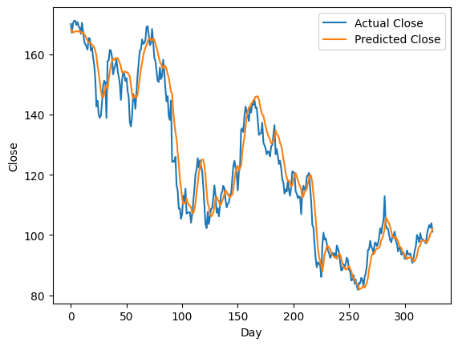

# A Machine Learning Course for Starters

This is a course for those looking to start their journey with machine learning and to implement its algorithms using **Python** and **Jupyter Notebooks**. The codes are fully functional and cover several aspects of supervised learning, unsupervised learning, and image processing algorithms with readily available instructions and comments inside. This course is divided into 7 modules that start with some basic explanation of Python commands - required for the learner to proceed through the course - and end with some advanced techniques for image processing.

---

### Module 1: Python Basic Syntax and Commands

Introduces basic Python commands, variables, and syntax. Demonstrates some functionalities of *Numpy* library to perform mathematical operations and *Matplotlib* to plot figures and visualize results.

[Jupyter Notebook](Module1-PythonBasics/Module1-Python-Basics.ipynb)

---
### Module 2: Linear Regression and Neural Networks

In the first notebook, we perform basic data analysis on the <ins>Diabetes Dataset</ins> using *Pandas* library and introduce main concepts of machine learning such as training and test sets and data scaling to train a linear regression model using *scikit-learn* package.

[Jupyter Notebook](Module2-NeuralNetworks/Module2-LinearRegression.ipynb)

In the second notebook, we create and train a fully-connected neural network (NN) using *Pytorch* to classify handwritten digits from the <ins>MNIST Dataset</ins>.

[Jupyter Notebook](Module2-NeuralNetworks/Module2-NeuralNetworks.ipynb)

MNIST Dataset Sample            |  Neural Network Confusion Matrix
:-------------------------:|:-------------------------:
  |  

---

### Module 3: Convolutional Neural Networks

In this module, we train a convolutional neural network (CNN) on the <ins>MNIST Dataset</ins> using *Pytorch* to gain better classification of the handwritten digits than a fully-connected neural network. 

[Jupyter Notebook](Module3-CNN/Module3-CNN.ipynb)

---

### Module 4: Recurrent Neural Networks

We implement a recurrent neural network (RNN) with using LSTM framework to train on predicting <ins>Amazon closing stock price</ins> based on historical data. First, the data is preprocessed using *Pandas* to target prices based on a lookback window to train and validate the model. Then, forecasting is performed on new dates to predict the closing price.

[Jupyter Notebook](Module4-RNN/Module4-RNN-LSTM.ipynb)

Historical Data            |  RNN Forecasting Results
:-------------------------:|:-------------------------:
 |  

---

### Module 5: Unsupervised Clustering with KMeans

In this module, we explore training machine learning models using unlabeled data. Specifically, we perform unsupervised clustering on the <ins>Iris Dataset</ins> using **KMeans** algorithm from the *scikit-learn* package. First, we use the Elbow method to determine the appropriate number of clusters for the dataset, and then we fit KMeans given the selected number of clusters. Once trained, the model can be used to perform predictions on new data.

[Jupyter Notebook](Module5-UnsupervisedLearning/Module5-UnsupervisedLearning-KMeans.ipynb)

Elbow Method            |  KMeans Clustering Results
:-------------------------:|:-------------------------:
 |  

---

### Module 6: Image Processing Techniques 

We perform image processing in **Python** using the *OpenCV* library to modify images and extract their features. In this module, we understand the structure of image pixels and RGB channels and how they are perceived by the machine. Image processing techniques are used to manipulate images and also serve as a crucial step for data augmentation in deep learning models and computer vision. We'll go through various concepts and techniques to process images.

[Jupyter Notebook](Module6-ImageProcessing/Module6-ImageProcessing.ipynb)

Original Image            |  Grayscale Image      |  Clustered Image using KMeans
:-------------------------:|:-------------------------:|:-------------------------:
 |   |  

---

### Module 7: Machine Learning Application in Structural Engineering 

In this final module, we apply our machine learning knowledge in training a neural network model to predict the lateral displacement of a 10-story building $\vec{u}$ due to an applied force to each story given by the loading vector $\vec{p}$. The true displacements are computed using the stiffness matrix of the structure $\mathbf{K}$.

Five test cases are analyzed to demonstrate the generalizability of the neural network: cases 1-3 are within the range of training data, while case 4 is out of range, and case 5 is at the limit of the range. This final example shows how machine learning can efficiently and effectively solve engineering problems and understand the underlying relations between the inputs and outputs while taking into account its limitations.

[Problem Statement](Module7-ML-Structures/problem_statement.pdf) \
[Juputer Notebook](Module7-ML-Structures/Module7-MachineLearning-Structures.ipynb)

---

### License

MIT

